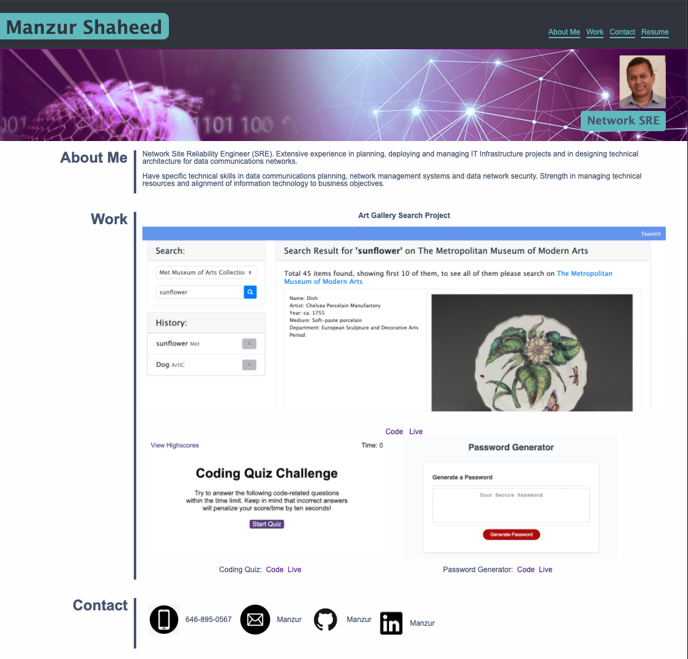
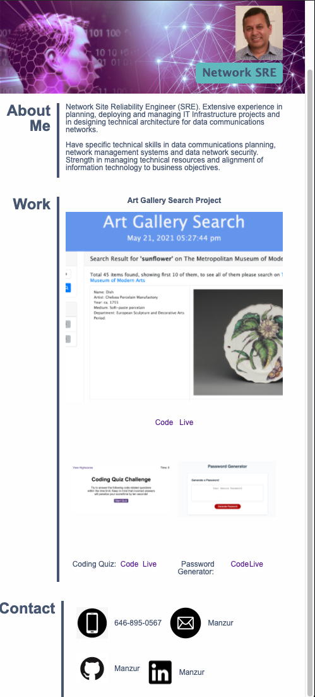

# Manzur's Portfolio

Portfolio page for Manzur Shaheed. Page shows a short paragraph about me, my works and how to contact me. There is also a link to my resume in PDF.

## Getting Started
Live at: https://manzur-shaheed.github.io/ms-portfolio/

Code is at: https://github.com/manzur-shaheed/ms-portfolio

You can copy it from my github pages by cloning [github link](git@github.com:manzur-shaheed/ms-portfolio.git).

## Deployment

The following image shows the web application's appearance and functionality:

Desktop View:

Mobile View:

## Built With

* HTML
* CSS

## Acknowledgments
* **Billie Thompson** - *Readme Doc* - [PurpleBooth](https://github.com/PurpleBooth)

